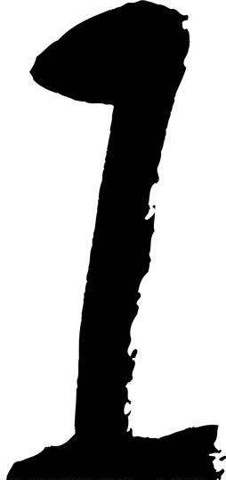
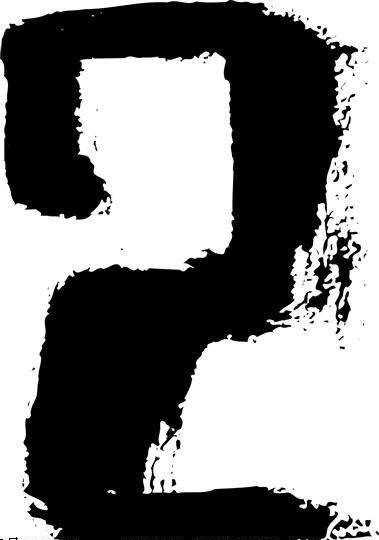
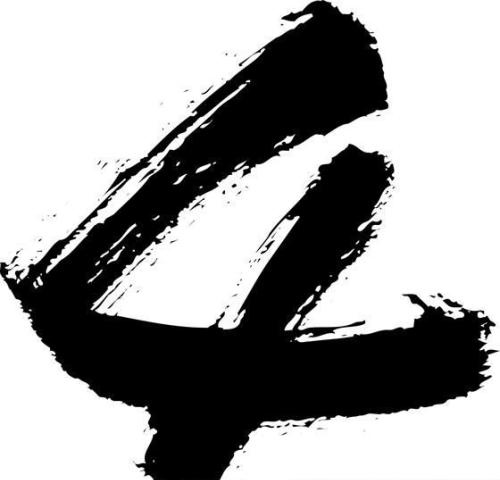
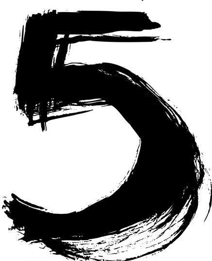

# 1. 原生 JS 实现无缝轮播图效果

## 1.1. HTML 基本布局

首先建立 html 基本布局

```JavaScript
<div class="box">

    <!-- ul 部分  -->
    <ul>
      <li></li>
      <li></li>
      <li></li>
      <li></li>
      <li></li>
    </ul>

    <!-- 小圆点部分 -->
    <ol>
    </ol>

    <!-- 箭头部分 -->
    <div class="arrow">
      <span class="left">&lt;</span>
      <span class="right">&gt;</span>
    </div>

  </div>
```


　　为了实现无缝轮播效果，实际上我们需要在图片 5 后面再添加一张图片 1。当焦点位于图片 5 时，如果再往后移动，整个队列就会被拉到真正的图片 1 ，而图片 5 后面的图片 1 只是为了让用户产生视觉差，从而不会让用户明显感觉到图片被倒向了图片 1，这样看起来就会像是无缝轮播了。这里我们后面用 JS 代码添加图片 1，也可以在 HTML 中直接添加。
　　小圆点部分因为需求的变化我们不在 HTML 中设置固定的个数，后面用 JS 来实现，而不用 JS 来添加图片是因为一般这种大的模块不利于 SEO 优化。

## 1.2. CSS 样式

首先，resetcss，如下所示：

```JavaScript
    /* 初始化 */
    * {
      margin: 0;
      padding: 0;
      list-style: none;
    }
```

接着，为了让图片只在`box`中显示，所以需要限定其宽度和高度并且使用`overflow:hidden`将其余的图片隐藏起来，并且我们希望`ul`相对于`box`左右移动，所以设置为相对定位`position: relative`。

```JavaScript
    /* box 部分 */
    .box {
      width: 500px;
      height: 300px;
      background: red;
      position: relative;
      overflow: hidden;
    }
```

设置 ul 是绝对定位的，所以就可以通过控制`Left`和`Right`来控制图片的移动。因为共有六张图片，所以`width`为 3000px（每张图片我们设置为 500X300）,我们只需让`li`左浮动即可实现排成一排。

```JavaScript
    /* ul 部分 */
    ul {
      width: 3000px;
      height: 300px;
    }

    ul li {
      float: left;
    }

    ul li img {
      width: 500px;
      height: 300px;
    }
```

小圆点部分，这里先用 CSS 画好，后面用 JS 来进行添加操作。

```JavaScript
    /* 小圆点部分*/
    ol {
      height: 20px;
      background: rgba(255, 255, 255, 0.5);
      position: absolute;
      left: 50%;
      bottom: 10px;
      transform: translateX(-50%);
      border-radius: 10px;
    }

    ol li {
      float: left;
      width: 12px;
      height: 12px;
      margin: 0 8px;
      margin-top: 4px;
      background: #fff;

      text-align: center;
      line-height: 12px;
      font-size: 10px;

      /* 不让文本选中 */
      user-select: none;

      /* 小手 */
      cursor: pointer;
      border-radius: 50%;
    }

    ol li.now {
      background: red;
    }
```

然后把左右箭头加上，并做一些简单的修饰。

```JavaScript
    /* 箭头部分 */
    .arrow {
      display: none;
    }

    .box:hover .arrow {
      display: block;
    }

    .left,
    .right {
      width: 30px;
      height: 60px;
      position: absolute;
      top: 50%;
      transform: translateY(-50%);
      background: rgba(0, 0, 0, 0.3);
      text-align: center;
      line-height: 60px;
      font-size: 32px;
      user-select: none;
      cursor: pointer;
    }

    .left {
      left: 0;
    }

    .right {
      right: 0;
    }
```

## 1.3. JS 代码

### 1.3.1. 功能 1 创建小圆点

```JavaScript
//1.1. 获取元素
var ul = document.querySelector('ul');
var ulis = ul.children;
var ol = document.querySelector('ol');

//1.2. 遍历图片创建小圆点
for ( var i = 0 ; i < ulis.length ; i++) {

  //1.3. 创建li三步走
  //1.3.1 创建li
  var li = document.createElement('li');
  //1.3.2 设置li
  li.innerText = i+1 ;
  //1.3.3 添加li
  ol.appendChild(li);
}

//1.4. 焦点变色
var olis = ol.children;
olis[0].className = 'now';
```

### 1.3.2. 功能 2 : 克隆第一张图片添加到最后

为了实现无缝轮播，我们需要把图 1 克隆到 ul 的最后面。

```JavaScript
ul.appendChild(ulis[0].cloneNode(true));
```

### 1.3.3. 封装移动函数`animate(element, target)`

```JavaScript
// 动画封装
// 参数1 : element元素对象
// 参数2 : 目标值
function animate( element, target) {

  // 清除上一个定时器
  clearInterval(element.timerId);

  element.timerId = setInterval(function () {

    //动画三步走
    //1. 获取当前位置
    var current = element.offsetLeft;

    //2. 累加小碎步
    // 方向 :
    var step =  current < target ? 20 : -20;
    // 什么时候走? 距离 > 步数
    if (Math.abs(target-current) >= Math.abs(step)) {

      current += step;
      //3. 重新赋值
      element.style.left = current + 'px';

    } else {

      // 清除定时器
      clearInterval(element.timerId);
      // 不到一步的,直接赋值即可
      element.style.left =  target + 'px';
    }

  },15);

}
```

### 1.3.4. 功能 3 : 左右箭头点击事件

```JavaScript
//3.1 获取元素
var arr_left = document.querySelector('.left');
var arr_right = document.querySelector('.right');
var box = document.querySelector('.box');
var imgWidth =  box.offsetWidth;

var  index = 0;

//3.2 注册事件-点击右键
arr_right.onclick = function () {

 // 动画之前处理无缝滚动 当index等于5时跳转到0
  if (index == 5) {
    index = 0;
    ul.style.left = 0;
  }

  // 移动动画
  index++;
  animate(ul,- index * imgWidth);

  // 动画之后 处理小圆点同步
  // 打印index 0-4 正好是下标
  for ( var i = 0 ; i < olis.length ; i++) {

    olis[i].className = '';
  }

  if (index == 5) {
    olis[0].className = 'now';
  }else {
    olis[index].className = 'now';
    }
  }

//3.3 注册事件-点击左键
arr_left.onclick = function () {

  // 动画之前处理 无缝滚动
  if (index == 0) {
    index = 5;
    ul.style.left = - index * imgWidth + 'px';
  }

  // 移动动画
  index--;
  animate(ul,- index * imgWidth);

  // 动画之后, 处理 同步小圆点
  for ( var i = 0 ; i < olis.length ; i++) {

    olis[i].className = '';
  }

  olis[index].className = 'now';
}
```

### 1.3.5. 功能 4 : 自动播放

```JavaScript
//获取元素
var arrow = document.querySelector('.arrow');
//加定时器
var timerId = setInterval(function () {
  arr_right.onclick();
  }, 1000);
```

### 1.3.6. 功能 5 ：鼠标放上去暂停

1. 当鼠标放入容器内时左右出现控制按钮，并且轮播动画停止。
2. 当鼠标移出时，控制按钮隐藏，轮播继续。

```JavaScript
//5.1.1 注册事件
box.onmouseover = function () {

  //5.1.2 清除定时器
  clearInterval(timerId);
  //5.1.3 箭头显示
  arrow.style.display = 'block';
}

// 5.2.1 注册事件
box.onmouseout = function () {

  //5.2.2 添加定时器
timerId = setInterval(function () {
  arr_right.onclick();
}, 1000);

// 5.2.3 箭头隐藏
arrow.style.display = 'none';
    }
```

### 1.3.7. 功能 6 : 点击小圆点

```JavaScript
//6.1 遍历注册点击事件
    for (var i = 0; i < olis.length; i++) {

      // 保存索引
      olis[i].index = i;
      olis[i].onclick = function () {

        // 6.2 点击哪个哪个变红
        for (var i = 0; i < olis.length; i++) {

          olis[i].className = '';
        }
        this.className = 'now';

        //6.3 点击小圆点 切换图片
        // 拿到索引
        console.log(this.index);

        // 当出现最后一个1的时候, 为了不让倒着出现2
        // 解决办法 : 把最后一个1, 立马切换到第一个1
        if (index == 5) {
          index = 0;
          ul.style.left = 0;
        }

        // 同步索引
        // 自定播放  点击最新的
        index = this.index;
        //下标索引 * 图片宽度  + 'px';
        animate(ul, -this.index * imgWidth);

      }
    }
```

### 1.3.8. 完整 JS 代码

```JavaScript
  <script src="./animate.js"></script>
  <script>
    var ul = document.querySelector('ul');
    var ulis = ul.children;
    var ol = document.querySelector('ol');

    for (var i = 0; i < ulis.length; i++) {

      var li = document.createElement('li');
      li.innerText = i + 1;
      ol.appendChild(li);
    }

    var olis = ol.children;
    olis[0].className = 'current';

    ul.appendChild(ulis[0].cloneNode(true));

    var arr_left = document.querySelector('.left');
    var arr_right = document.querySelector('.right');
    var box = document.querySelector('.box');
    var imgWidth = box.offsetWidth;

    var index = 0;

    arr_right.onclick = function () {

      if (index == 5) {
        index = 0;
        ul.style.left = 0;
      }

      index++;
      animate(ul, -index * imgWidth);

      console.log(index);
      for (var i = 0; i < olis.length; i++) {

        olis[i].className = '';
      }

      if (index == 5) {
        olis[0].className = 'current';
      } else {
        olis[index].className = 'current';
      }
    }

    arr_left.onclick = function () {

      if (index == 0) {
        index = 5;
        ul.style.left = -index * imgWidth + 'px';
      }

      index--;
      animate(ul, -index * imgWidth);

      console.log(index);
      for (var i = 0; i < olis.length; i++) {

        olis[i].className = '';
      }
      olis[index].className = 'current';

    }

    var arrow = document.querySelector('.arrow');
    var timerId = setInterval(function () {
      arr_right.onclick();
    }, 1000);

    box.onmouseover = function () {

      clearInterval(timerId);
      arrow.style.display = 'block';
    }

    box.onmouseout = function () {

      timerId = setInterval(function () {
        arr_right.onclick();
      }, 1000);
    }

      arrow.style.display = 'none';

      for (var i = 0; i < olis.length; i++) {

      olis[i].index = i;
      olis[i].onclick = function () {

        for (var i = 0; i < olis.length; i++) {

          olis[i].className = '';
        }
        this.className = 'now';

        console.log(this.index);

        if (index == 5) {
          index = 0;
          ul.style.left = 0;
        }

        index = this.index;
        animate(ul, -this.index * imgWidth);

      }
    }

  </script>
```
